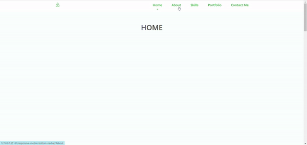
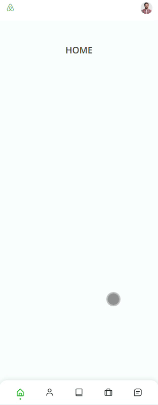

# Responsive Navbar [ BOTTOM NAVBAR FOR MOBILE ( like mobile application.) ]
<a href="https://www.linkedin.com/in/dharmendraverma95/" target="_blank">LinkedIn Profile </a>

<a href="https://www.behance.net/dhirukumar" target="_blank">Behance Profile </a>

##responsive navbar with bottom navbar for all the device below 768px. Smooth scrolling in each section and active nav-link

### Responsive Navbar with bottom navbar for Mobile Sizes
-- bottom navbar like mobile application --

## Desgin 
<ul>
  <li>Lower navigation bar using HTML, CSS and JavaScript.</li>
  <li>First design with labels in the navigation bar.</li>
  <li>Second design with points in the navigation bar.</li>
  <li>Smooth scrolling in each section.</li>
  <li>Developed first with the Mobile First methodology, then for desktop.</li>
  <li>Compatible with all mobile devices and with a beautiful and pleasant user interface.</li>
</ul>

###### Lang
<ul>
  <li>HTML</li>
  <li>CSS</li>
  <li>javascript</li>
  <li>images from freepik</li>
  <li>resposive desgin</li>
  <li>desgin in Abode XD</li>
</ul>
 
--desktop design 

 
 
 
--mobile design 

